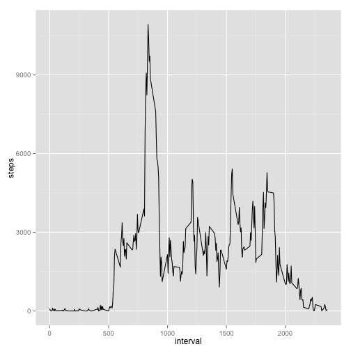
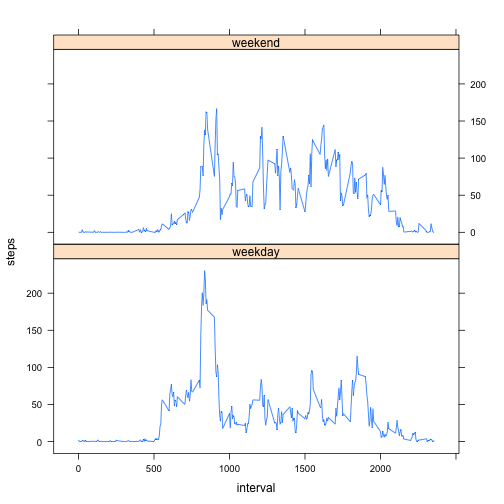

Reproducible Research - Peer Assignment 1
========================================================

Peer assessment 1 assignment for Coursera course on **Reproducible Research**

# Assignment

This assignment will be described in multiple parts. You will need to
write a report that answers the questions detailed below. Ultimately,
you will need to complete the entire assignment in a **single R
markdown** document that can be processed by **knitr** and be
transformed into an HTML file.

Throughout your report make sure you always include the code that you
used to generate the output you present. When writing code chunks in
the R markdown document, always use `echo = TRUE` so that someone else
will be able to read the code. **This assignment will be evaluated via
peer assessment so it is essential that your peer evaluators be able
to review the code for your analysis**.

For the plotting aspects of this assignment, feel free to use any
plotting system in R (i.e., base, lattice, ggplot2)

Fork/clone the [GitHub repository created for this
assignment](http://github.com/rdpeng/RepData_PeerAssessment1). You
will submit this assignment by pushing your completed files into your
forked repository on GitHub. The assignment submission will consist of
the URL to your GitHub repository and the SHA-1 commit ID for your
repository state.

NOTE: The GitHub repository also contains the dataset for the
assignment so you do not have to download the data separately.

> ## Loading and preprocessing the data

>   Show any code that is needed to

> 1. Load the data (i.e. `read.csv()`)

> 2. Process/transform the data (if necessary) into a format suitable for your analysis


```r
setwd("/Users/mohana/Documents/Coursera/WDir") # 1. Load & Process
activity <- read.csv("activity.csv",stringsAsFactors = FALSE) 
```

> ## What is mean total number of steps taken per day?
> 
> For this part of the assignment, you can ignore the missing values in
> the dataset.
> 
> 1. Make a histogram of the total number of steps taken each day
> 
> 2. Calculate and report the **mean** and **median** total number of steps taken per day


```r
clean_activity <- activity[complete.cases(activity$steps),] # 1. Histogram
totalSteps <- aggregate(steps ~ date, data = clean_activity, 
          FUN = sum)
names(totalSteps)[2]<-paste("sumofSteps")
hist(totalSteps$sumofSteps, xlab = "Total no of Steps per day", ylab = "Number of Instances", main = "Total Steps Taken per Day")
```

 

```r
c(Mean=mean(totalSteps$sumofSteps),Median = median(totalSteps$sumofSteps)) # 2. Calcuate Mean and Median
```

```
##   Mean Median 
##  10766  10765
```

> ## What is the average daily activity pattern?
> 
> 1. Make a time series plot (i.e. `type = "l"`) of the 5-minute interval (x-axis) and the average number of steps taken, averaged across all days (y-axis)
> 
> 2. Which 5-minute interval, on average across all the days in the dataset, contains the maximum number of steps?


```r
library(ggplot2) # 1. Time Series plot
intervalSteps <- aggregate(steps ~ interval, data = clean_activity, 
                        FUN = sum) 
ggplot(intervalSteps, aes(x = interval, y = steps)) + geom_line()
```

 

```r
intervalSteps$interval[intervalSteps$steps == max(intervalSteps$steps, na.rm=TRUE)] # 2. Top "5 Minute interval" steps
```

```
## [1] 835
```

> ## Imputing missing values
> 
> Note that there are a number of days/intervals where there are missing
> values (coded as `NA`). The presence of missing days may introduce
> bias into some calculations or summaries of the data.
> 
> 1. Calculate and report the total number of missing values in the dataset (i.e. the total number of rows with `NA`s)
> 
> 2. Devise a strategy for filling in all of the missing values in the dataset. The strategy does not need to be sophisticated. For example, you could use the mean/median for that day, or the mean for that 5-minute interval, etc.
> 
> 3. Create a new dataset that is equal to the original dataset but with the missing data filled in.
> 
> 4. Make a histogram of the total number of steps taken each day and Calculate and report the **mean** and **median** total number of steps taken per day. Do these values differ from the estimates from the first part of the assignment? What is the impact of imputing missing data on the estimates of the total daily number of steps?


```r
nrow(activity[!complete.cases(activity),]) # 1. Missing Values
```

```
## [1] 2304
```

```r
interval_activity <- aggregate(steps ~ interval, data = clean_activity, # 2. Update interval mean for NA
                  FUN = mean)
noNA_activity <- activity
# Loop in interval mean into missing values
for (i in 1:length(noNA_activity[, 1])) {
    if (is.na(noNA_activity[i,1]))
        {noNA_activity[i,1]<-interval_activity[which(interval_activity$interval==noNA_activity[i,3]), 2]}
    else if (is.na(noNA_activity[i,1])==FALSE)
        {noNA_activity[i,1]<-noNA_activity[i,1]}
}

total_noNA_Steps <- aggregate(steps ~ date, data = noNA_activity, 
          FUN = sum)
names(total_noNA_Steps)[2]<-paste("sumofSteps")
hist(total_noNA_Steps$sumofSteps, xlab = "Total no of Steps per day", ylab = "Number of Instances", main = "Total Steps Taken per Day")
```

 

```r
c(NewMean=mean(total_noNA_Steps$sumofSteps),Mean=mean(totalSteps$sumofSteps),NewMedian = median(total_noNA_Steps$sumofSteps),Median = median(totalSteps$sumofSteps))
```

```
##   NewMean      Mean NewMedian    Median 
##     10766     10766     10766     10765
```

Do these values differ from the estimates from the first part of the assignment? What is the impact of imputing missing data on the estimates of the total daily number of steps?

Only the median changes but not the mean as we are imputing the mean into the dataset.

> ## Are there differences in activity patterns between weekdays and weekends?
> 
> For this part the `weekdays()` function may be of some help here. Use
> the dataset with the filled-in missing values for this part.
> 
> 1. Create a new factor variable in the dataset with two levels -- "weekday" and "weekend" indicating whether a given date is a weekday or weekend day.
> 
> 2. Make a panel plot containing a time series plot (i.e. `type = "l"`) of the 5-minute interval (x-axis) and the average number of steps taken, averaged across all weekday days or weekend days (y-axis). 


```r
library(lattice)
weekend_activity <- noNA_activity # 1. Update Weekend and Weekday
weekend_activity$date <- as.Date(weekend_activity$date)
weekend_activity$steps <- round(weekend_activity$steps,2)

for (i in 1:length(weekend_activity[, 2])){
    if (weekdays(weekend_activity[i, 2])=="Saturday")
        {weekend_activity$weekend[i]<-'weekend'}
    else if (weekdays(weekend_activity[i, 2])=="Sunday")
        {weekend_activity$weekend[i]<-'weekend'}
    else {weekend_activity$weekend[i]<-'weekday'}
}

agg_weekend_activity <- aggregate(steps ~ weekend+interval, data = weekend_activity, 
                              FUN = mean) # 2. Time series with weekend & weekday
xyplot(steps~interval|weekend, data=agg_weekend_activity, type='l', layout=c(1, 2))
```

 
